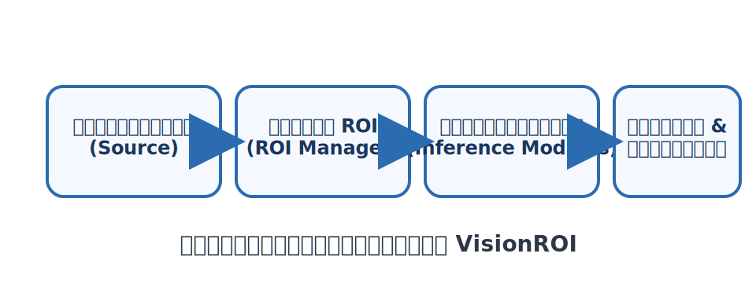

# VisionROI

<p align="center">
  
</p>

<p align="center">
  <a href="https://www.python.org/">
    
  </a>
  <a href="https://quart.palletsprojects.com/">
    
  </a>
  <a href="https://ffmpeg.org/">
    
  </a>
  <a href="LICENSE">
    
  </a>
</p>

โปรเจ็กต์ **VisionROI** เป็นแอป Quart สำหรับทดสอบ OCR และการจัดการ ROI

## สารบัญ
- [🚀 การเริ่มต้นอย่างรวดเร็ว](#การเริ่มต้นอย่างรวดเร็ว)
- [✨ ฟีเจอร์](#ฟีเจอร์)
- [🧭 โครงสร้างโปรเจ็กต์](#โครงสร้างโปรเจ็กต์)
- [🎥 Backend การสตรีม](#backend-การสตรีม)
- [🛠️ ข้อกำหนดระบบ](#ข้อกำหนดระบบ)
- [📦 การติดตั้ง](#การติดตั้ง)
- [▶️ การรันโปรเจ็กต์](#การรันโปรเจ็กต์)
- [🖼️ ตัวอย่าง: ทดสอบด้วยไฟล์ภาพนิ่ง (`screen.jpg`)](#ตัวอย่าง-ทดสอบด้วยไฟล์ภาพนิ่ง-screenjpg)
- [🔁 โฟลว์การทำงานจากการสร้าง Source ถึงการรัน Inference Group](#โฟลว์การทำงานจากการสร้าง-source-ถึงการรัน-inference-group)
- [🔔 การตั้งค่าการแจ้งเตือน](#การตั้งค่าการแจ้งเตือน)
- [🪟 หน้าต่างต่าง ๆ](#หน้าต่างต่าง-ๆ)
- [🔌 API/Endpoints](#apiendpoints)
- [🧪 การพัฒนาและการทดสอบ](#การพัฒนาและการทดสอบ)
- [♻️ การกู้คืนงานอัตโนมัติ](#การกู้คืนงานอัตโนมัติ)
- [🗂️ โครงสร้าง `data_sources/`](#โครงสร้าง-data_sources)
- [ℹ️ ข้อมูลเพิ่มเติม](#ข้อมูลเพิ่มเติม)
- [🤝 การร่วมพัฒนา](#การร่วมพัฒนา)
- [✅ การทดสอบ](#การทดสอบ)
- [📄 License](#license)

<a id="การเริ่มต้นอย่างรวดเร็ว"></a>
## 🚀 การเริ่มต้นอย่างรวดเร็ว

1. สร้าง virtual environment แล้ว activate:

   ```bash
   python -m venv .venv
   source .venv/bin/activate  # บน Windows ใช้ .venv\\Scripts\\activate
   ```

2. ติดตั้งแพ็กเกจของโปรเจ็กต์และ dependencies หลัก (ถ้าต้องการรันผ่าน **uvicorn** หรือใช้งานโมเดลเพิ่มเติม ให้ติดตั้ง extras ตามความต้องการ):

   ```bash
   pip install "."
   pip install ".[server]"      # (ตัวเลือก) ติดตั้ง uvicorn + websockets
   pip install ".[onnx]"        # (ตัวเลือก) ใช้งานโมเดล ONNX
   pip install ".[torch]"       # (ตัวเลือก) ใช้งานโมเดลที่พึ่งพา PyTorch/Transformers
   pip install ".[tflite]"      # (ตัวเลือก) ใช้งานโมเดล TensorFlow Lite
   pip install ".[tensorrt]"    # (ตัวเลือก) ใช้งาน TensorRT backend
   ```

   > หากยังไม่ได้ติดตั้งไลบรารีระบบ เช่น `tesseract` หรือแพ็กเกจที่เกี่ยวข้อง โปรดดูหัวข้อ [ติดตั้ง System Dependencies ที่จำเป็น](#ติดตั้ง-system-dependencies-ที่จำเป็น)

3. ตรวจสอบให้แน่ใจว่าเครื่องมีคำสั่ง `ffmpeg` (จำเป็นเมื่อเลือก backend แบบ `ffmpeg`).
   บน Ubuntu สามารถติดตั้งได้ด้วย `sudo apt install ffmpeg` ส่วน Windows สามารถดาวน์โหลดจาก [FFmpeg.org](https://ffmpeg.org) แล้วเพิ่มลงใน PATH.
   สามารถตรวจสอบได้ด้วยคำสั่ง `ffmpeg -version` หากใช้เฉพาะ backend `opencv` สามารถข้ามขั้นตอนนี้ได้

4. รันแอปพลิเคชัน (ค่าเริ่มต้นใช้พอร์ต `5000` หากต้องการกำหนดพอร์ตเองให้เพิ่ม `--port`).
   หากต้องการใช้เซิร์ฟเวอร์ **uvicorn** (แนะนำสำหรับการใช้งานจริง) ให้เพิ่ม `--use-uvicorn`:

   ```bash
   python app.py                       # ใช้เซิร์ฟเวอร์ภายใน
   python app.py --port 12000          # ระบุพอร์ตเอง
   python app.py --use-uvicorn         # รันด้วย uvicorn
   ```

5. เปิดเบราว์เซอร์ไปที่ `http://localhost:5000/` หรือ `/home` (หรือพอร์ตที่กำหนด)

### พารามิเตอร์บรรทัดคำสั่งของ `app.py`
- `--port <int>` – กำหนดพอร์ตที่เว็บเซิร์ฟเวอร์จะรับคำขอ (ค่าเริ่มต้น 5000)
- `--use-uvicorn` – สลับไปใช้เซิร์ฟเวอร์ `uvicorn` พร้อมค่าตั้งต้นที่เหมาะสำหรับการใช้งานจริง เช่น `timeout_keep_alive=2`

ค่าดีฟอลต์ของแอปจะรับคำขอบน `0.0.0.0` เพื่อให้เข้าถึงได้จากเครื่องอื่นในเครือข่ายเดียวกัน หากต้องการผูกกับอินเทอร์เฟซเฉพาะสามารถรันผ่าน `uvicorn` และเพิ่มอาร์กิวเมนต์ `--host` เอง:

```bash
uvicorn app:app --host 127.0.0.1 --port 8000
```

<a id="ฟีเจอร์"></a>
## ✨ ฟีเจอร์
- เลือกและบันทึกตำแหน่ง ROI จากกล้องหรือวิดีโอ พร้อมระบุโมดูล inference และคอนฟิก MQTT แยกต่อ ROI ได้จากหน้าเดียว
- รันโมเดลเพื่อตรวจจับข้อความหรือวัตถุใน ROI ตามกลุ่มที่เลือก (Inference Group) และควบคุม `interval`, `result_timeout`, การแสดงกรอบเพจ (`draw_page_boxes`) ได้จาก UI/REST API
- หน้า Inference Page (`/inference_page`) ใช้ตรวจจับหน้ากระดาษและ ROI ที่สังกัดเพจ พร้อมแสดงกรอบเพจบนวิดีโอแบบเรียลไทม์
- หน้า Home (`/home`) เป็นแดชบอร์ดเรียลไทม์ แสดงจำนวนงานที่กำลังรัน, อัตราออนไลน์, โมดูลที่ใช้, ค่าประสิทธิภาพ และการแจ้งเตือนล่าสุด โดยดึงข้อมูลจาก API `GET /api/dashboard`
- รองรับการแจ้งเตือนผ่าน Telegram และบันทึกผลสรุปของแต่ละเฟรมลง `recent_notifications` เพื่อใช้กับแดชบอร์ดและระบบแจ้งเตือนอื่น
- รวมผลลัพธ์ ROI ที่ประมวลผลในเฟรมเดียวกันให้เป็น payload เดียว ส่งออกทั้งผ่าน WebSocket (`/ws_roi_result/<cam_id>`) และบันทึกลง `custom.log` ด้วย prefix `AGGREGATED_ROI`
- จัดการการเชื่อมต่อ MQTT ได้ผ่านหน้า `/create_mqtt` และ API `/mqtt_configs` โดยรองรับค่าพิเศษเช่น TLS, QoS, retain, `publish_timeout`
- มาพร้อมโมดูลตัวอย่าง `typhoon_ocr`, `yolo`, `easy_ocr`, `rapid_ocr`, `trocr` และ `tesseract_ocr` เพื่อเริ่มต้นทดลองใช้งาน
- มี `CameraWorker` สำหรับดึงเฟรมจากสตรีมวิดีโอทั้งผ่าน OpenCV และ `ffmpeg`
- รวมแพ็กเกจโมเดลเสริมใน `src/packages/models` เช่น `rtdetr` และ `yolov8`
- บันทึกสถานะกล้องและงาน inference ลงไฟล์ `service_state.json` พร้อมข้อมูลแหล่งสัญญาณ, ความละเอียด, backend, กลุ่มที่กำลังทำงาน, ค่า `interval`, `result_timeout`, สถานะการรัน, ค่า `draw_page_boxes` และชื่อ source ล่าสุด เพื่อให้ `restore_service_state()` เริ่มงานเดิมให้อัตโนมัติหลังรีสตาร์ทเซิร์ฟเวอร์
- มี endpoint `GET /_healthz` สำหรับตรวจสอบสถานะ และ `POST /_quit` สำหรับสั่งปิดเซิร์ฟเวอร์อย่างนุ่มนวล

<a id="การกู้คืนงานอัตโนมัติ"></a>
### ♻️ การกู้คืนงานอัตโนมัติ

ทุกครั้งที่มีการเริ่มหรือหยุดงาน ROI หรือ inference ระบบจะบันทึกสถานะล่าสุดไว้ในไฟล์ `service_state.json`
ซึ่งรวมถึงชื่อ source ต้นทาง, ความละเอียดของเฟรมล่าสุด, backend, กลุ่ม ROI ที่ใช้งาน, ค่า `interval`, ค่า `result_timeout`, ธง `draw_page_boxes`, ชื่อที่ผู้ใช้ตั้ง และสถานะการรัน
เมื่อรีสตาร์ทแอป ฟังก์ชัน `restore_service_state()` ใน `app.py` จะโหลดไฟล์ดังกล่าวเพื่อเริ่มงานเดิมให้อัตโนมัติ รวมถึงกู้คืนค่าคอนฟิกกล้องและงาน inference ที่ยังค้างอยู่
หากไม่ต้องการให้ระบบกู้คืนงาน สามารถลบไฟล์ `service_state.json` ก่อนสตาร์ทแอปใหม่ได้

<a id="โครงสร้างโปรเจ็กต์"></a>
## 🧭 โครงสร้างโปรเจ็กต์

```
VisionROI/
├── app.py                # แอปหลัก
├── camera_worker.py      # worker จัดการสตรีมวิดีโอ
├── data_sources/         # คอนฟิกและไฟล์ ROI ของแต่ละ source
├── inference_modules/    # โมดูล inference เช่น typhoon_ocr, yolo, easy_ocr, rapid_ocr, trocr, tesseract_ocr
├── src/
│   └── packages/
│       ├── models/       # โมเดลเสริม เช่น rtdetr, yolov8
│       └── notification/ # ฟังก์ชันแจ้งเตือน
├── static/               # ไฟล์ front-end
├── templates/            # เทมเพลต HTML
└── tests/                # เทสต์ด้วย pytest
```

<a id="backend-การสตรีม"></a>
## 🎥 Backend การสตรีม

ระบบรองรับ backend การอ่านสตรีมวิดีโอ 2 แบบหลัก ๆ:

- `opencv` – ใช้ `cv2.VideoCapture` เหมาะสำหรับการทดสอบทั่วไปและอุปกรณ์ที่รองรับ OpenCV โดยตรง
- `ffmpeg` – ใช้คำสั่ง `ffmpeg` เพื่อส่งเฟรมแบบ `bgr24` ผ่าน `stdout` ให้ความเสถียรกับสตรีม RTSP และสามารถปรับขนาดภาพล่วงหน้าได้ (จำเป็นต้องติดตั้งคำสั่ง `ffmpeg` ให้เรียกได้จาก PATH)

สามารถกำหนด backend ได้จากคีย์ `stream_type` ในไฟล์ `data_sources/<name>/config.json`, ผ่านหน้าเว็บ `/create_source` หรือ API `PATCH /update_stream_type/<name>` หากไม่ระบุจะใช้ `opencv` เป็นค่าเริ่มต้น

<a id="ข้อกำหนดระบบ"></a>
## 🛠️ ข้อกำหนดระบบ
- Python ≥3.10
- dependencies ถูกกำหนดใน `pyproject.toml`

### Dependencies หลัก
- `Quart`
- `opencv-python`
- `numpy`
- `Pillow`
- `easyocr`
- `rapidocr`
- `rapidocr_onnxruntime`
- `pytesseract`
- `paho-mqtt`
- `requests`

### Dependencies เพิ่มเติม (Extras)
| Extra | แพ็กเกจที่ติดตั้ง | การใช้งานหลัก |
| --- | --- | --- |
| `server` | `uvicorn`, `websockets` | รันแอปด้วย Uvicorn และรองรับ WebSocket client จำนวนมาก |
| `onnx` | `onnx`, `onnxruntime` | โหลด/รันโมเดลในรูปแบบ ONNX |
| `torch` | `torch`, `torchvision`, `transformers` | ทำงานกับโมเดลที่พึ่งพา PyTorch หรือ Hugging Face |
| `tflite` | `tensorflow` | ใช้งานโมเดล TensorFlow Lite |
| `tensorrt` | `tensorrt`, `pycuda`, `torch`, `torchvision`, `onnx` | เตรียม TensorRT backend และเครื่องมือที่เกี่ยวข้อง |

เมื่อต้องการติดตั้งหลายชุดพร้อมกันสามารถระบุในคำสั่งเดียว เช่น `pip install ".[server,onnx]"` เพื่อยืดหยุ่นกับกรณีการใช้งานจริง

<a id="การติดตั้ง"></a>
## 📦 การติดตั้ง
แนะนำให้สร้าง virtual environment ก่อน:

```bash
python -m venv .venv
```

หลังจากสร้างแล้ว ให้ activate environment:

- **Linux/macOS**

  ```bash
  source .venv/bin/activate
  ```

- **Windows**

  ```powershell
  .venv\\Scripts\\activate
  ```

เมื่อ environment ถูก activate แล้วให้ติดตั้งแพ็กเกจหลัก และเลือกเสริมส่วนที่ต้องใช้:

```bash
pip install "."              # ติดตั้งแพ็กเกจหลัก
pip install ".[server]"      # (ทางเลือก) ใช้ uvicorn + websockets
pip install ".[onnx,torch]"  # (ตัวอย่าง) ติดตั้ง extras หลายชุดพร้อมกัน
```

หากต้องการติดตั้งแบบ editable เพื่อแก้ไขซอร์สโค้ดโดยตรง:

```bash
pip install -e "."
```

### ติดตั้งแบบกึ่งอัตโนมัติด้วยสคริปต์ `install.sh`
สำหรับผู้ที่ใช้งานบน Linux (โดยเฉพาะ Ubuntu/Debian) และต้องการตั้งค่าระบบอย่างรวดเร็ว โปรเจ็กต์มีสคริปต์ `install.sh` เพื่อช่วยเตรียมสภาพแวดล้อมพื้นฐานให้โดยอัตโนมัติ:

1. ตรวจสอบให้แน่ใจว่ามีคำสั่ง `git` และ `python3-venv` ติดตั้งในระบบแล้ว
2. ดาวน์โหลดสคริปต์หรือคัดลอกจากรากโปรเจ็กต์ แล้วรันคำสั่ง:

   ```bash
   bash install.sh
   ```

สคริปต์จะทำหน้าที่ดังนี้

- ติดตั้งไลบรารีระบบที่จำเป็นผ่าน `apt` (หากพบคำสั่ง)
- สร้าง virtual environment ไว้ที่ `~/SMARTSense/ninenox/venv`
- โคลนหรืออัปเดตรีโปซิตอรี `VisionROI`
- ติดตั้งแพ็กเกจ Python หลักพร้อม extras `server`

เมื่อรันสคริปต์เสร็จจะพร้อมใช้งานคำสั่ง `python app.py --use-uvicorn` ทันที หากต้องการปรับเส้นทางหรือชื่อผู้ใช้สามารถแก้ตัวแปรด้านบนของไฟล์ `install.sh` ก่อนรันได้

### ติดตั้ง System Dependencies ที่จำเป็น
แพ็กเกจบางตัวต้องพึ่งพาไลบรารีระดับระบบปฏิบัติการ โดยเฉพาะเมื่อต้องใช้งานโมดูล OCR (`pytesseract`) และการประมวลผลภาพผ่าน OpenCV:

- **Ubuntu / Debian**

  ```bash
  sudo apt update
  sudo apt install ffmpeg tesseract-ocr libtesseract-dev libgl1 libglib2.0-0
  ```

- **macOS (ผ่าน Homebrew)**

  ```bash
  brew install ffmpeg tesseract
  ```

- **Windows**

  1. ดาวน์โหลดและติดตั้ง [FFmpeg](https://ffmpeg.org/download.html) แล้วเพิ่มลงใน `PATH`.
  2. ดาวน์โหลดและติดตั้ง [Tesseract OCR](https://github.com/UB-Mannheim/tesseract/wiki) แล้วเพิ่มโฟลเดอร์ที่มี `tesseract.exe` ลงใน `PATH`.

หลังจากติดตั้งระบบเรียบร้อยสามารถตรวจสอบว่า `ffmpeg` และ `tesseract` ใช้งานได้ด้วยคำสั่ง `ffmpeg -version` และ `tesseract --version` เพื่อยืนยันว่า backend `ffmpeg` และโมดูล `pytesseract` พร้อมใช้งาน

### ตัวแปรสภาพแวดล้อมที่สำคัญ
- `INFERENCE_RESULT_TIMEOUT` – กำหนดเวลารอผลลัพธ์จากโมดูล inference ต่อ ROI หน่วยเป็นวินาที (ค่าเริ่มต้น `10.0`). หากต้องการลดความถี่ในการตัดการเชื่อมต่อของ WebSocket ในงานที่ใช้เวลาประมวลผลยาว ควรกำหนดค่าให้อยู่เหนือระยะเวลาประมวลผลสูงสุดของแต่ละโมดูล และสามารถ override เป็นรายงาน (per job) ผ่าน `result_timeout` ในคำสั่ง `POST /start_inference` (ส่ง `null` เพื่อกลับมาใช้ค่าจากตัวแปรสภาพแวดล้อม)


## ไฟล์และโฟลเดอร์สำคัญ
ตารางต่อไปนี้สรุปหน้าที่ของไฟล์และโฟลเดอร์หลักในโปรเจ็กต์เพื่อให้ง่ายต่อการอ้างอิงขณะพัฒนา:

| เส้นทาง | รายละเอียด |
| --- | --- |
| `app.py` | จุดเริ่มต้นของแอป Quart กำหนดเส้นทางหลักและการตั้งค่าเซิร์ฟเวอร์ |
| `camera_worker.py` | โมดูลสำหรับบริหาร worker ที่ดึงภาพจากกล้องหรือสตรีม |
| `data_sources/` | เก็บไฟล์คอนฟิกของแต่ละ source รวมถึง ROI ที่บันทึกไว้ |
| `inference_modules/` | รวมโมดูล inference ย่อย เช่น `typhoon_ocr`, `yolo`, `easy_ocr`, `rapid_ocr`, `trocr`, `tesseract_ocr` |
| `src/packages/` | ยูทิลิตีและแพ็กเกจเสริม เช่น โมดูลโมเดลใน `models/` และการแจ้งเตือนใน `notification/` |
| `static/` | ไฟล์ front-end เช่น JavaScript, CSS และรูปภาพ |
| `templates/` | เทมเพลต HTML ของหน้า UI ต่าง ๆ |
| `tests/` | ชุดเทสต์ที่รันด้วย `pytest` สำหรับตรวจสอบพฤติกรรมสำคัญ |
| `pyproject.toml` | ไฟล์กำหนด dependencies และเมทาดาตาของแพ็กเกจ |

<a id="การรันโปรเจ็กต์"></a>
## ▶️ การรันโปรเจ็กต์
1. รัน `python app.py` (ระบุพอร์ตเองได้ด้วย `--port`; ระหว่างพัฒนาอาจใช้ `quart --app app:app run --reload --port 12000`)
2. เปิดเบราว์เซอร์ไปที่ `http://localhost:5000/` หรือพอร์ตที่กำหนด (ระบบจะรีไดเรกต์ไปหน้า `/home`)

### ตรวจสอบสุขภาพระบบอย่างรวดเร็ว
หลังการติดตั้งและเริ่มเซิร์ฟเวอร์แล้ว สามารถยืนยันสถานะของบริการและปิดระบบอย่างปลอดภัยด้วยคำสั่งต่อไปนี้:

- ตรวจสอบว่าเซิร์ฟเวอร์พร้อมให้บริการ:

  ```bash
  curl http://localhost:5000/_healthz
  ```

- สั่งปิดเซิร์ฟเวอร์อย่างนุ่มนวลเมื่อทดสอบเสร็จ:

  ```bash
  curl -X POST http://localhost:5000/_quit
  ```

คำตอบที่ได้จะเป็น plain text (`"ok"`, `"shutting down"`, ฯลฯ) พร้อมสถานะ HTTP ที่สื่อถึงผลลัพธ์ หากพบปัญหา (เช่น worker ไม่ตอบสนองหรือกล้องเปิดไม่ติด) จะได้รับรหัสสถานะอื่นร่วมกับข้อความอธิบายเพื่อช่วยวิเคราะห์สาเหตุได้ง่ายขึ้น

<a id="ตัวอย่าง-ทดสอบด้วยไฟล์ภาพนิ่ง-screenjpg"></a>
### 🖼️ ตัวอย่าง: ทดสอบด้วยไฟล์ภาพนิ่ง (`screen.jpg`)
ในกรณีที่ต้องการทดสอบฟีเจอร์ของ VisionROI โดยไม่มีสตรีมวิดีโอหรือกล้องจริง สามารถใช้ไฟล์ภาพนิ่งเพื่อจำลองแหล่งภาพได้ตามขั้นตอนนี้ โดยโปรเจ็กต์เตรียมไฟล์ `screen.jpg` ไว้ให้แล้ว (อยู่ที่รากโปรเจ็กต์เดียวกับ `app.py`) เพียงนำไฟล์นี้ไปตั้งเป็นแหล่งภาพของกล้องก็สามารถเปิดหน้าเว็บทดสอบได้ทันที:

1. รันเซิร์ฟเวอร์ด้วย `python app.py` ตามปกติ
2. เปิดเทอร์มินัลอีกหน้าหนึ่ง แล้วลงทะเบียน source ชื่อ `demo_image` (สั่งครั้งแรกครั้งเดียว หากสร้างไว้แล้วสามารถข้ามได้)

   ```bash
   curl -X POST "http://localhost:5000/create_source" \
        -F "name=demo_image" \
        -F "source=$(pwd)/screen.jpg" \
        -F "stream_type=opencv"
   ```

   > **หมายเหตุ**: หากต้องการกำหนดผ่านหน้าเว็บ สามารถเข้า `/create_source` แล้วกรอก `screen.jpg` ในช่อง Camera Source ได้เลย ระบบจะบันทึกพาธจากรากโปรเจ็กต์ให้โดยอัตโนมัติ

3. สั่งให้ worker อ่านไฟล์ภาพนิ่งเพื่อจำลองสตรีมวิดีโอ

   ```bash
   SOURCE_PATH="$(pwd)/screen.jpg"
   curl -X POST "http://localhost:5000/start_roi_stream/demo_image" \
        -H "Content-Type: application/json" \
        -d '{
              "name": "demo_image",
              "source": "'"${SOURCE_PATH}"'",
              "stream_type": "opencv"
            }'
   ```

4. ขอภาพตัวอย่างจาก worker เพื่อยืนยันว่าอ่านภาพนิ่งได้แล้ว (ไฟล์ `snapshot.jpg` จะมีเนื้อหาเดียวกับ `screen.jpg`)

   ```bash
   curl "http://localhost:5000/ws_snapshot/demo_image" --output snapshot.jpg
   ```

5. เมื่อทดลองเสร็จให้หยุดการอ่านภาพนิ่ง

   ```bash
   curl -X POST "http://localhost:5000/stop_roi_stream/demo_image"
   ```

เมื่อมีการสร้าง source `demo_image` แล้ว สามารถเปิดหน้า `/roi` หรือ `/inference` เพื่อทดลองเลือก ROI หรือเรียกใช้โมดูลต่าง ๆ กับภาพนิ่งดังกล่าวได้ทันที (ระบบจะใช้เฟรมเดิมจากไฟล์ `screen.jpg` ซ้ำ)

<a id="โฟลว์การทำงานจากการสร้าง-source-ถึงการรัน-inference-group"></a>
## 🔁 โฟลว์การทำงานจากการสร้าง Source ถึงการรัน Inference Group
1. ไปที่หน้า `/create_source` เพื่อสร้าง source ใหม่ โดยกรอกชื่อและแหล่งกล้อง
2. เลือก source ที่ต้องการในหน้า UI (ระบบจะตั้งค่ากล้องให้อัตโนมัติเมื่อเริ่มสตรีมภาพหรือทำ inference)
3. เปิดหน้า `/roi` แล้วเลือกตำแหน่ง ROI ที่ต้องการ จากนั้นกดบันทึก (ROI แต่ละจุดสามารถระบุโมดูลของตัวเองได้) – เรียก `POST /save_roi`
4. หากต้องการตรวจจับหน้ากระดาษ ให้เข้า Inference Page ที่ `/inference_page` เพื่อดูผลลัพธ์การตรวจจับเพจ
5. เข้า `/inference` แล้วเลือก source กล้องและกลุ่ม ROI เพื่อเริ่มประมวลผล (หากเลือกค่า `All` จะบังคับประมวลผล ROI ทุกตัว) สามารถปรับ `interval`, เลือก group, เปิดหลายงานพร้อมกัน และอ่านผลจาก `/ws_roi_result/<cam_id>` โดยที่ `cam_id` เป็นคีย์สตริง (เช่น `inf_cam1`)
6. เมื่อเสร็จสิ้นสามารถหยุดงานได้ที่ `POST /stop_inference/<cam_id>`

<a id="การตั้งค่าการแจ้งเตือน"></a>
## 🔔 การตั้งค่าการแจ้งเตือน
### Telegram Notify
ตัวอย่างการใช้งาน:

```python
from src.packages.notification.telegram_notify import TelegramNotify

tg = TelegramNotify(token="YOUR_BOT_TOKEN", chat_id="YOUR_CHAT_ID")
tg.start_send_text("สวัสดี")
```

### MQTT ต่อ ROI
- สามารถสร้างคอนฟิก MQTT ได้จากหน้า `/create_mqtt` หรือเรียก `POST /mqtt_configs` โดยระบุ `name`, `host`, `port`, `username`, `password`, `base_topic`, `client_id`, `qos`, `retain`, `tls`, `keepalive` และ `publish_timeout` (หน่วยวินาที)
- ค่าที่บันทึกจะถูกเก็บในไฟล์ `mqtt_configs.json` และสามารถเรียกดูได้ด้วย `GET /mqtt_configs` หรือแก้ไขผ่าน UI ได้ทันที
- เมื่อมีคอนฟิกแล้ว หน้า `/roi` จะให้เลือกคอนฟิก MQTT แยกสำหรับแต่ละ ROI ได้ ทำให้ ROI ที่สำคัญสามารถส่งข้อมูลคนละ broker หรือ broker เดียวกันแต่คนละ topic ได้ และยังสามารถสลับคอนฟิกได้โดยไม่ต้องรีสตาร์ทงาน inference
- หากเลือกคอนฟิกไว้ ROI นั้น ๆ จะเรียก `publish_roi_to_mqtt()` อัตโนมัติเมื่อมีผลลัพธ์จาก inference โดยใช้ค่า QoS, retain, TLS และ `publish_timeout` ตามคอนฟิกที่กำหนด
- โครงสร้าง topic ที่ระบบสร้างคือ:

  ```
  <base_topic>/<source>/<group>/<roi_id>
  ```

  แต่ละส่วนจะถูกแปลงให้เป็นตัวอักษร, ตัวเลข, `_` หรือ `-` เท่านั้น และตัดช่องว่างออก เช่น `My Camera` จะกลายเป็น `My_Camera`
- ตัวอย่าง: หากตั้งค่า `base_topic` เป็น `vision`, source ชื่อ `cam_north`, กลุ่ม `group_a`, ROI ลำดับ `3` จะได้ topic `vision/cam_north/group_a/3`
- Payload ที่ส่งเป็น JSON ประกอบด้วย `cam_id`, `source`, `group`, `roi_id`, `roi_name`, `module`, `text`, `frame_time`, `result_time` และอาจมี `duration` หากโมดูลส่งค่ามา พร้อมบันทึกลง log `data_sources/<source>/custom.log` (ภายใต้ prefix `AGGREGATED_ROI`) และเก็บสรุปไว้ใน `recent_notifications`

<a id="หน้าต่างต่าง-ๆ"></a>
## 🪟 หน้าต่างต่าง ๆ
### Home (`/home`)
แดชบอร์ดแบบเรียลไทม์ แสดงจำนวนกล้องที่ออนไลน์, งาน inference ที่กำลังทำงาน, กลุ่ม ROI ที่รันอยู่, ค่าเฉลี่ย `interval/fps`, แจ้งเตือนล่าสุด และประสิทธิภาพของแต่ละโมดูล พร้อมการ์ดสรุป ROI ต่อแหล่งสัญญาณและกราฟเปรียบเทียบโมดูลเร็ว/ช้า หน้าเพจนี้รีเฟรชข้อมูลทุก ~6 วินาทีผ่าน API `GET /api/dashboard`

### Docs (`/docs`)
สรุปขั้นตอนใช้งานแบบย่อและอธิบายเมนูหลักภายในระบบ เหมาะสำหรับผู้ใช้ใหม่หรือใช้เป็นคู่มือประกอบการฝึกอบรม

### Create Source (`/create_source`)
สร้างและจัดการ source โดยระบุชื่อ, พาธ/URL ของกล้อง, backend (`opencv`/`ffmpeg`) และความละเอียด หากบันทึกสำเร็จ รายการจะแสดงในตารางพร้อมปุ่มลบ นอกจากนี้ยังสามารถดาวน์โหลดหรือแก้ไขไฟล์ `config.json` ได้โดยตรงที่โฟลเดอร์ `data_sources/<name>`

### ROI Selection (`/roi`)
เลือกและบันทึกตำแหน่ง ROI ตาม source ที่เลือก กำหนดชื่อ, กลุ่ม, โมดูล inference, flag การบันทึกภาพ และเลือกคอนฟิก MQTT ต่อ ROI ได้จากหน้าเดียว ระบบจะสร้างไฟล์ JSON ภายใต้ `data_sources/<source>/` ให้โดยอัตโนมัติ

### Inference Group (`/inference`)
จัดการงาน inference แบบไดนามิก สามารถเปิดหลายงานพร้อมกัน, เลือก group หรือ `all`, ตั้งค่า `interval`, ปรับแหล่งสัญญาณ, ดู log ล่าสุด และรับผลลัพธ์ผ่าน WebSocket `/ws_roi_result/<cam_id>` หน้า UI จะดึงรูป ROI, ผลลัพธ์, ระยะเวลาประมวลผล และบันทึกค่าลง `recent_notifications` เพื่อใช้ในแดชบอร์ดและ MQTT

### Inference Page (`/inference_page`)
โหมดติดตามเพจ เรียก `start_inference` พร้อม `draw_page_boxes: true` เพื่อแสดงกรอบเพจบนวิดีโอ และแสดงตารางคะแนนการจับคู่เพจ/ROI สำหรับงานที่ต้องตรวจสอบหน้ากระดาษหรือฟอร์มหลายหน้าโดยเฉพาะ

### Create MQTT (`/create_mqtt`)
ฟอร์มบริหารคอนฟิก MQTT แสดงรายการที่มีอยู่, ปุ่มรีเฟรช, ปุ่มลบ และบันทึกค่าลงไฟล์ `mqtt_configs.json` อัตโนมัติ เหมาะสำหรับเตรียม profile หลายชุดเพื่อเชื่อมต่อ broker ที่แตกต่างกัน

<a id="apiendpoints"></a>
## 🔌 API/Endpoints

- **POST `/start_inference/<cam_id>`** – เริ่มอ่านภาพและประมวลผล ROI ที่ส่งมา (หากไม่ส่ง `rois` จะโหลดจากไฟล์ของ source ที่เลือกไว้ก่อนหน้า) พร้อมตั้งค่ากล้องจากข้อมูลใน body (`name`, `source`, `width`, `height`, `stream_type`) และสามารถระบุ `group` เพื่อบังคับเลือก ROI group; หากส่งค่า `all` จะประมวลผล ROI ทุกตัวโดยไม่สนใจผลการจับหน้ากระดาษ ค่า `interval` (หน่วยวินาที) ใช้กำหนดช่วงเวลาการประมวลผล, `result_timeout` ใช้กำหนดเวลารอผลลัพธ์ต่อเฟรม และ `draw_page_boxes` ใช้บังคับวาดกรอบเพจบนวิดีโอ ค่าทั้งหมดจะถูกบันทึกใน `service_state.json` เพื่อใช้ต่อในการรีสตาร์ทครั้งถัดไป โดย `cam_id` สามารถเป็นสตริงใด ๆ เพื่อแยกกล้องแต่ละหน้าตามต้องการ
  ```json
  {
    "name": "cam1",
    "source": "0",
    "stream_type": "ffmpeg",
    "group": "p1",
    "interval": 0.5,
    "result_timeout": 12.0,
    "draw_page_boxes": false,
    "rois": [
      {
        "id": "1",
        "module": "typhoon_ocr",
        "points": [
          {"x": 10, "y": 20},
          {"x": 110, "y": 20},
          {"x": 110, "y": 100},
          {"x": 10, "y": 100}
        ]
      }
    ]
  }
  ```
  ตอบกลับสำเร็จจะอยู่ในรูป `{"status": "started", "cam_id": "<id>"}` หรือ `"already_running"` หากสตรีมกำลังทำงานอยู่ ส่วนกรณีที่หน้า ROI ยังทำงานอยู่จะได้ `{"status": "roi_running", "cam_id": "<id>"}` พร้อม HTTP 400 และหากเปิดกล้องไม่สำเร็จจะคืน `{"status": "error", "message": "open_failed"}`

- **POST `/stop_inference/<cam_id>`** – หยุดงาน inference ส่งสัญญาณให้ WebSocket ปิดตัวและล้างสถานะกล้องกับ queue ที่เกี่ยวข้อง

- **POST `/start_roi_stream/<cam_id>`** – เริ่มส่งภาพสดสำหรับหน้าเลือก ROI พร้อมตั้งค่ากล้องจากข้อมูลใน body (`name`, `source`, `width`, `height`, `stream_type`) หากงาน inference กำลังทำงานอยู่จะได้รับ `{"status": "inference_running"}` พร้อม HTTP 400

- **POST `/stop_roi_stream/<cam_id>`** – หยุดส่งภาพ ROI และคืนทรัพยากรของกล้องเมื่อไม่มีงานอื่นใช้งานอยู่

- **GET `/roi_stream_status/<cam_id>`** – ตรวจสอบว่างาน ROI stream กำลังทำงานอยู่หรือไม่ (ตอบกลับประกอบด้วย `running`, `cam_id` และ `source` ล่าสุดของสตรีมนั้น)

- **GET `/inference_status/<cam_id>`** – ตรวจสอบสถานะของงาน inference ที่ระบุ โดยจะตอบกลับ `running`, `cam_id`, `source` ปัจจุบัน และ `group` ที่กำลังประมวลผล (ถ้าไม่ได้ล็อกกลุ่มไว้จะเป็นสตริงว่าง)
  ```json
  {"running": true, "cam_id": "inf_cam1", "source": "demo_image", "group": "p1"}
  ```

- **POST `/save_roi`** – บันทึก ROI ลงไฟล์ของ source หรือพาธที่กำหนด
  ```json
  {
    "source": "cam1",
    "rois": [
      {
        "id": "1",
        "module": "typhoon_ocr",
        "points": [
          {"x": 10, "y": 20},
          {"x": 110, "y": 20},
          {"x": 110, "y": 100},
          {"x": 10, "y": 100}
        ]
      }
    ]
  }
  ```
  นอกจากส่งชื่อ source แล้ว ยังสามารถระบุ query string `?path=<ไฟล์ปลายทางภายใต้ data_sources>` เพื่อบันทึก ROI ไปยังไฟล์อื่น (เช่น `POST /save_roi?path=cam1/backup/rois_backup.json`). ฟังก์ชันจะสร้างโฟลเดอร์ให้โดยอัตโนมัติและตรวจสอบว่าอยู่ในไดเรกทอรีที่อนุญาตก่อนเสมอ

- **GET `/load_roi/<name>`** – โหลด ROI ล่าสุดของ source นั้น
  ```bash
  GET /load_roi/cam1
  ```

- **GET `/load_roi_file`** – โหลด ROI จากพาธที่ระบุในพารามิเตอร์ `path`
  ```bash
  GET /load_roi_file?path=data_sources/cam1/rois.json
  ```

- **GET `/read_log`** – อ่านบรรทัดล่าสุดจากไฟล์ `custom.log` ของ source ที่ระบุผ่านพารามิเตอร์ `source` (สามารถกำหนดจำนวนบรรทัดด้วย `lines`, ค่าเริ่มต้น 40). เมื่อระบบบันทึกผลลัพธ์แบบรวมจะขึ้นต้นด้วย `AGGREGATED_ROI ` แล้วตามด้วย JSON ที่มีโครงสร้างเดียวกับข้อความจาก WebSocket ทำให้สามารถ parse เพื่อวิเคราะห์ย้อนหลังได้ง่าย

- **GET `/ws_snapshot/<cam_id>`** – คืนรูป JPEG หนึ่งเฟรมจากกล้อง (ต้องมี worker ของกล้องนั้นทำงานอยู่ มิฉะนั้นจะตอบกลับข้อผิดพลาด)

- **GET `/data_sources`** – รายชื่อ source ทั้งหมดในระบบ

- **GET `/inference_modules`** – รายชื่อโมดูล inference ที่มีในระบบ
- **GET `/groups`** – รายชื่อ group หรือ page ที่พบใน ROI ของทุก source
- **GET `/source_list`** – รายชื่อ source พร้อมรายละเอียดของแต่ละตัว

- **GET `/source_config`** – คืนค่าคอนฟิกของ source ตามชื่อที่ระบุผ่านพารามิเตอร์ `name`

- **GET `/api/dashboard`** – คืนข้อมูลสรุปให้แดชบอร์ด เช่น จำนวนกล้องที่ออนไลน์, ROI ต่อโมดูล, การแจ้งเตือนล่าสุด และค่าประสิทธิภาพของแต่ละโมดูล
- **GET `/docs`** – เรนเดอร์หน้าเอกสารประกอบการใช้งาน (สามารถใช้เป็น health check ของเทมเพลตได้เช่นกัน)

- **GET `/mqtt_configs`** – รายชื่อคอนฟิก MQTT ทั้งหมดในระบบ (รูปแบบ JSON)
- **POST `/mqtt_configs`** – สร้างหรืออัปเดตคอนฟิก MQTT (body เป็น JSON ตามฟิลด์ที่อธิบายในหัวข้อ [MQTT ต่อ ROI](#mqtt-ต่อ-roi))
- **DELETE `/mqtt_configs/<name>`** – ลบคอนฟิก MQTT ตามชื่อ

- **DELETE `/delete_source/<name>`** – ลบโฟลเดอร์และไฟล์ที่เกี่ยวกับ source นั้น
- **PATCH `/update_stream_type/<name>`** – ปรับชนิดการสตรีม (`opencv` หรือ `ffmpeg`) ของ source ที่ระบุ

- **GET `/_healthz`** – ตรวจสอบสถานะเซิร์ฟเวอร์ (ตอบกลับเป็นข้อความ `"ok"` พร้อม HTTP 200)
- **POST `/_quit`** – สั่งปิดเซิร์ฟเวอร์อย่างนุ่มนวล (ตอบกลับเป็นข้อความสั้น ๆ เช่น `"shutting down"` พร้อม HTTP 202)

- **WebSocket `/ws`** – ส่งภาพ JPEG แบบไบนารีต่อเนื่องสำหรับหน้า `/inference`

- **WebSocket `/ws_roi`** – ส่งภาพ JPEG แบบไบนารีต่อเนื่องสำหรับหน้า `/roi`

- **WebSocket `/ws_roi_result/<cam_id>`** – ส่งข้อมูลผลลัพธ์ของงาน inference ตามสถานะปัจจุบัน โดยมีสองรูปแบบข้อความหลัก
  - ข้อความคะแนนการจับหน้ากระดาษ `{"group": "<ชื่อเพจ>", "scores": [{"page": "...", "score": 0.87}, ...]}` ใช้สำหรับเลือกกลุ่ม ROI ตามเทมเพลตเพจ
  - ข้อความสรุปผลลัพธ์ ROI ในเฟรมนั้น มีรูปแบบตัวอย่างดังนี้

    ```json
    {
      "frame_time": 1700000000.123,
      "result_time": 1700000000.456,
      "cam_id": "inf_cam1",
      "source": "demo_image",
      "group": "p1",
      "results": [
        {
          "id": "1",
          "name": "เลขที่เอกสาร",
          "text": "INV-001",
          "module": "typhoon_ocr",
          "duration": 0.42,
          "image": "<base64 JPEG>",
          "frame_time": 1700000000.123,
          "result_time": 1700000000.456,
          "group": "p1",
          "source": "demo_image",
          "cam_id": "inf_cam1",
          "mqtt_config": "prod"
        }
      ]
    }
    ```

  แต่ละข้อความอาจมี `image` เป็น Base64 JPEG (หากตั้งให้บันทึก ROI), ระยะเวลา `duration` ที่โมดูลใช้ประมวลผล, ค่ารวม `frame_duration` ของเฟรมทั้งภาพ และชื่อคอนฟิก MQTT หากมีการเผยแพร่ผลลัพธ์ไปยัง broker เดียวกัน ขณะที่ไฟล์ `custom.log` จะเก็บข้อมูลแบบย่อภายใต้ prefix `AGGREGATED_ROI` โดยคงไว้เฉพาะฟิลด์สำคัญ เช่น `id`, `name`, `text`, `module`, `duration` และ `frame_duration` (ถ้ามี) เพื่อให้ log มีขนาดเหมาะสม


<a id="การพัฒนาและการทดสอบ"></a>
## 🧪 การพัฒนาและการทดสอบ

เพื่อช่วยให้งานพัฒนาเป็นระบบมากขึ้น สามารถใช้คำสั่งด้านล่างในการตั้งค่าและตรวจสอบโค้ด:

1. ติดตั้งแพ็กเกจแบบ editable พร้อม extras ที่จำเป็นสำหรับการทดสอบโมดูลเสริม (เช่น `server` สำหรับ Uvicorn หรือ `onnx` สำหรับโมเดล ONNX):

   ```bash
   pip install -e ".[server,onnx]"
   ```

2. รันชุดทดสอบอัตโนมัติด้วย `pytest` เพื่อยืนยันว่าโค้ดยังทำงานถูกต้องหลังแก้ไข:

   ```bash
   pytest
   ```

3. เมื่อต้องการพัฒนา UI สามารถเปิดเซิร์ฟเวอร์แบบ reload อัตโนมัติ:

   ```bash
   quart --app app:app run --reload --port 12000
   ```

   โหมดนี้เหมาะสำหรับการปรับเทมเพลตหรือสคริปต์ front-end เพราะจะแสดงผลการแก้ไขทันทีโดยไม่ต้องรีสตาร์ทเซิร์ฟเวอร์


<a id="โครงสร้าง-data_sources"></a>
## 🗂️ โครงสร้าง `data_sources/`
```
data_sources/
└── <name>/
    ├─ config.json
    └─ rois.json
```

ไฟล์ `rois.json` เก็บข้อมูล ROI โดยมีคีย์ `type` แยกชนิดระหว่าง ROI ปกติ (`roi`) และเพจ (`page`):

```json
[
  {
    "id": "1",
    "group": "p1",
    "module": "",
    "points": [
      {"x": 10, "y": 20},
      {"x": 110, "y": 20},
      {"x": 110, "y": 100},
      {"x": 10, "y": 100}
    ],
    "type": "roi"
  },
  {
    "id": "roi_123",
    "page": "page1",
    "points": [
      {"x": 0, "y": 0},
      {"x": 100, "y": 0},
      {"x": 100, "y": 80},
      {"x": 0, "y": 80}
    ],
    "image": "<base64>",
    "type": "page"
  }
]
```

ROI ปกติสามารถกำหนด `group` สำหรับเลือก group id ได้ ส่วนค่า `module` จะเริ่มต้นเป็นค่าว่าง
หากเว้นว่างจะไม่ประมวลผล ROI นั้น ส่วน ROI ที่มี `type` เป็น `page` จะบันทึกชื่อ (`page`) และรูปภาพที่ครอปไว้ในฟิลด์ `image`

### รายละเอียดไฟล์ `config.json`
ทุก source จะมีไฟล์ `config.json` เก็บค่าพื้นฐานสำหรับการเปิดสตรีมและค้นหาไฟล์ ROI โดยคีย์ที่ใช้บ่อยมีดังนี้:

| คีย์ | คำอธิบาย |
| --- | --- |
| `name` | ชื่อ source ซึ่งตรงกับชื่อโฟลเดอร์ภายใต้ `data_sources/` |
| `source` | ค่าแหล่งวิดีโอที่ส่งให้ backend เช่น หมายเลขกล้อง (`0`) หรือ URL RTSP/ไฟล์ |
| `rois` | ชื่อไฟล์ ROI ที่ใช้งาน (ค่าเริ่มต้น `rois.json`) |
| `stream_type` | ประเภท backend ที่จะใช้ เปิดได้ทั้ง `opencv` และ `ffmpeg` |
| `width`, `height` | (ตัวเลือก) ระบุความกว้าง/สูงที่ต้องการส่งให้ worker เพื่อปรับขนาดก่อนประมวลผล |

ตัวอย่างไฟล์:

```json
{
  "name": "demo_cam",
  "source": "rtsp://192.168.1.10/stream",
  "rois": "rois.json",
  "stream_type": "ffmpeg",
  "width": 1280,
  "height": 720
}
```

สามารถปรับค่าเหล่านี้ผ่านหน้า `/create_source` หรือแก้ไขไฟล์ด้วยตนเอง (อย่าลืมรีสตาร์ทงานเพื่อให้ค่าใหม่มีผล) หากต้องการสลับ backend อย่างรวดเร็วสามารถเรียก API `PATCH /update_stream_type/<name>` ได้เช่นกัน


โมดูลสำหรับประมวลผลจะเก็บไว้ในโฟลเดอร์ `inference_modules/<module_name>/custom.py`

ตัวอย่างโมดูลที่มีให้:
- `typhoon_ocr` – OCR เอกสารทั่วไป
- `yolo` – ตรวจจับวัตถุพื้นฐานด้วย YOLOv8
- `easy_ocr` – OCR ด้วยไลบรารี EasyOCR
- `rapid_ocr` – OCR ด้วยไลบรารี RapidOCR
- `trocr` – OCR ด้วยโมเดล TrOCR จาก HuggingFace Transformers
- `tesseract_ocr` – OCR ด้วยไลบรารี Tesseract (pytesseract)
- `light_button` – ตรวจสอบสถานะไฟของปุ่ม (on/off) จากค่าเฉลี่ยความสว่างของภาพ

### สร้างโมดูล inference เพิ่มเติม

เมธอด `process` ของโมดูลจะถูกเรียกพร้อมอาร์กิวเมนต์อย่างน้อย `[frame, roi_id, save_flag]` และหากฟังก์ชันรองรับพารามิเตอร์ชื่อ `source`, `cam_id` หรือ `interval` ระบบจะส่งค่าเหล่านี้ไปด้วยโดยอัตโนมัติ ข้อมูลที่คืนค่าควรเป็นสตริงหรือดิกชันนารีที่มีคีย์ `text` เพื่อให้ UI แสดงผลได้ อีกทั้งควรมีฟังก์ชัน `cleanup()` สำหรับคืนทรัพยากรเมื่อหยุดงาน

ตัวอย่างการใช้งานคลาส OCR:

```python
from inference_modules.easy_ocr.custom import EasyOCR

ocr = EasyOCR()
text = ocr.process(frame, roi_id="1", save=True, source="demo")
```

<a id="ข้อมูลเพิ่มเติม"></a>
## ℹ️ ข้อมูลเพิ่มเติม
- `config.json` เก็บข้อมูล source และไฟล์ ROI
- `service_state.json` จะถูกสร้างอัตโนมัติเมื่อมีการเริ่มงาน ROI หรือ inference เพื่อเก็บสถานะล่าสุดของกล้องแต่ละตัว รวมถึงค่า `interval`, `result_timeout` และ `draw_page_boxes`
- `mqtt_configs.json` เก็บรายการคอนฟิก MQTT ที่สร้างผ่านหน้า `/create_mqtt` หรือ API `/mqtt_configs`
- `custom.log` ภายใต้ `data_sources/<name>/` ใช้สำหรับบันทึกผลลัพธ์หรือข้อความจากโมดูล `custom.py` รวมถึง log ที่ส่งต่อจาก MQTT ข้อมูลผลลัพธ์ที่ระบบรวมให้จะขึ้นต้นด้วย `AGGREGATED_ROI ` แล้วตามด้วย JSON แบบย่อ (มีฟิลด์หลัก เช่น `id`, `name`, `text`, `module`, `duration`) เพื่อใช้วิเคราะห์ย้อนหลังได้สะดวก
- `inference_modules/<module>/custom.log` จะเก็บ log ของโมดูลแต่ละตัว (เหมาะสำหรับ debug pipeline)
- ระบบจะเก็บผลสรุปการ inference ล่าสุดไว้ในหน่วยความจำสูงสุด 200 รายการ (`recent_notifications`) เพื่อนำไปแสดงบนแดชบอร์ดและใช้กับระบบแจ้งเตือนภายนอก

<a id="การร่วมพัฒนา"></a>
## 🤝 การร่วมพัฒนา
- หากพบปัญหาหรือมีข้อเสนอแนะ สามารถเปิด issue ได้
- ก่อนส่ง pull request กรุณารัน `pytest` เพื่อให้แน่ใจว่าเทสต์ทั้งหมดผ่าน
- อธิบายรายละเอียดการเปลี่ยนแปลงใน PR เพื่อให้รีวิวได้ง่ายขึ้น

### เคล็ดลับการแก้ปัญหาเบื้องต้น
- หากเปิดสตรีมด้วย `ffmpeg` แล้วไม่ขึ้นภาพ ให้ตรวจสอบว่าคำสั่ง `ffmpeg` สามารถรันได้จากเทอร์มินัลเดียวกัน (`ffmpeg -version`).
- เมื่อโมดูล inference แจ้งว่าไม่พบบริการ OCR ให้ยืนยันว่าได้ติดตั้ง extras ที่ตรงกับโมดูลนั้น เช่น `pip install ".[torch]"` สำหรับโมดูลที่ใช้ PyTorch.
- หากแอปอ่านไฟล์ ROI ไม่ได้ ตรวจสอบสิทธิ์การเข้าถึงโฟลเดอร์ `data_sources/<name>` และความถูกต้องของ JSON ด้วย `python -m json.tool data_sources/<name>/rois.json`.

<a id="การทดสอบ"></a>
## ✅ การทดสอบ
โปรเจ็กต์มีเทสต์ตัวอย่างใช้ `pytest`
หากยังไม่มี `pytest` ให้ติดตั้งก่อน:

```bash
pip install pytest
```

จากนั้นรันเทสต์ทั้งหมดได้ด้วยคำสั่ง:

```bash
pytest
```

แนะนำให้รันเทสต์ภายใน virtual environment เดียวกับที่ติดตั้งแพ็กเกจของโปรเจ็กต์ไว้เสมอ เพื่อให้ dependency เหมือนกับสภาพแวดล้อมการรันจริง นอกจากนี้
ระหว่างพัฒนาอาจระบุพาธหรือชื่อเทสต์เฉพาะเพื่อให้ได้รอบ feedback ที่เร็วขึ้น เช่น:

```bash
pytest tests/test_inference_routes.py -k "start_inference"   # รันเฉพาะเทสต์ที่มีคำว่า start_inference
pytest -vv --maxfail=1                                      # แสดง log ละเอียดและหยุดเมื่อเจอข้อผิดพลาดแรก
```

หากต้องการตรวจสอบว่าซอร์สโค้ดสามารถถูกคอมไพล์เป็น bytecode ได้ครบทุกไฟล์ก่อน deploy ให้ใช้คำสั่งต่อไปนี้ร่วมกับเทสต์:

```bash
python -m compileall src inference_modules
```

คำสั่งข้างต้นจะช่วยจับ SyntaxError หรือฟังก์ชันที่อ้างถึงโมดูลผิดพลาดตั้งแต่ต้นน้ำ เมื่อใช้ควบคู่กับ `pytest` จะลดโอกาสพบปัญหาระหว่างรันระบบจริงได้มากขึ้น

## คำถามที่พบบ่อย (FAQ)

### ถ้าติดตั้ง extras แล้วแต่โมดูลยัง ImportError อยู่ต้องทำอย่างไร?
ตรวจสอบว่าได้ activate virtual environment ที่ถูกต้องก่อนรันคำสั่ง `python app.py` รวมถึงยืนยันว่าการติดตั้ง extras สำเร็จจริงด้วย `pip show` เช่น
`pip show torch`. ในบางระบบอาจต้องติดตั้งไลบรารีระบบเพิ่มเติมตามหัวข้อ [ติดตั้ง System Dependencies ที่จำเป็น](#ติดตั้ง-system-dependencies-ที่จำเป็น)
เพื่อให้โมดูลสามารถทำงานได้ครบถ้วน

### สามารถใช้กล้อง USB หลายตัวพร้อมกันได้หรือไม่?
ทำได้ โดยให้สร้าง source แยกแต่ละตัวและกำหนด `cam_id` คนละค่าเมื่อตั้งค่า inference. หากกล้องบางตัวต้องใช้ backend ต่างกัน (เช่น `opencv` กับ
`ffmpeg`) ก็สามารถสลับได้จากหน้าสร้าง source หรือเรียก API `PATCH /update_stream_type/<name>` ได้ทันทีโดยไม่ต้องแก้ไขโค้ด

### จะตรวจสอบ log ของโมดูล inference ได้จากที่ไหน?
ทุกโมดูลสามารถเขียนข้อความลงไฟล์ `data_sources/<source>/custom.log` ระหว่างรันงาน เมื่อพบปัญหาให้เปิดไฟล์ดังกล่าวหรือตั้งค่าให้ระบบส่ง log ไปยัง MQTT
เพื่อติดตามสถานะได้แบบเรียลไทม์ นอกจากนี้ API `GET /read_log` ยังช่วยดึงบรรทัดล่าสุดมาดูผ่าน terminal หรือสคริปต์อัตโนมัติได้สะดวก

<a id="license"></a>
## 📄 License

โค้ดนี้เผยแพร่ภายใต้เงื่อนไขที่ต้องอ้างอิงแหล่งที่มา ดูรายละเอียดเพิ่มเติมในไฟล์ [LICENSE](LICENSE)

